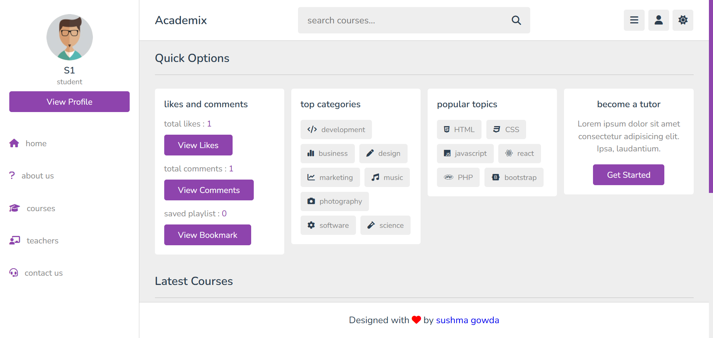
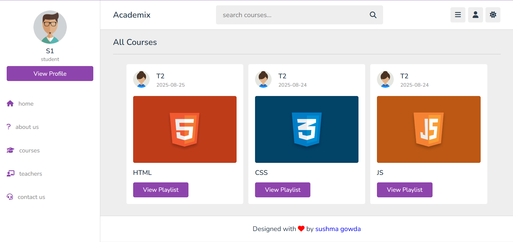
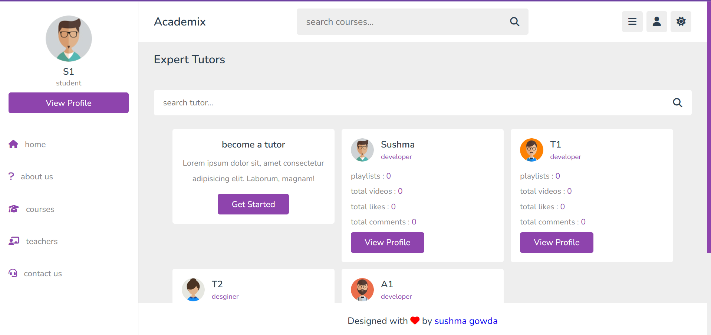
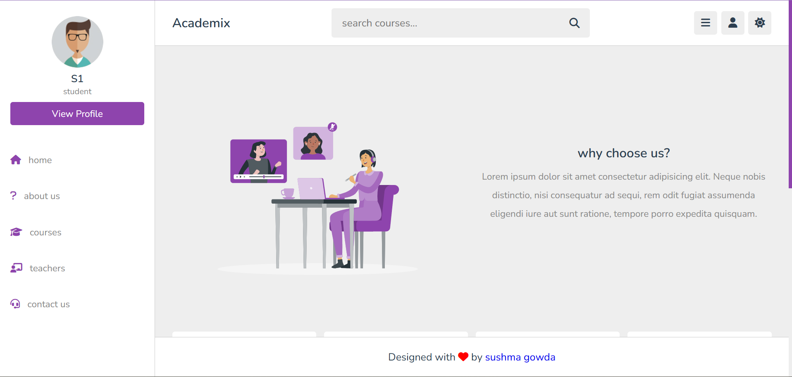
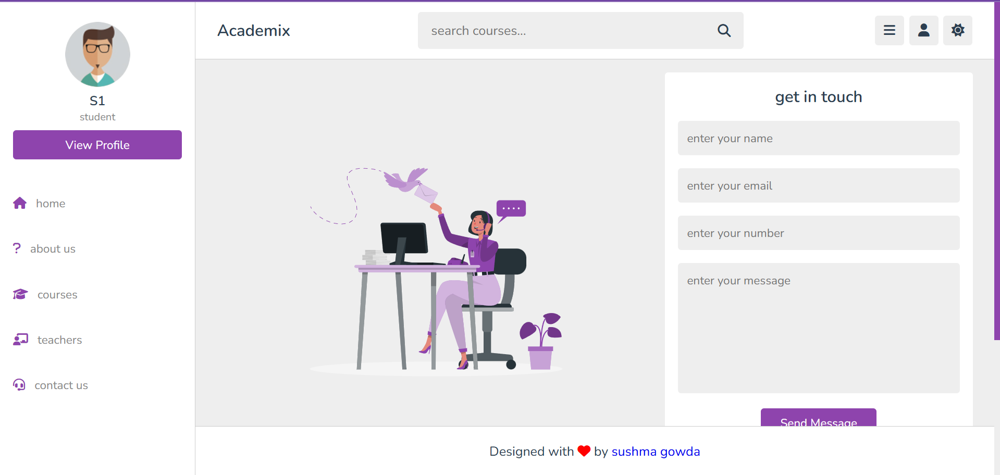
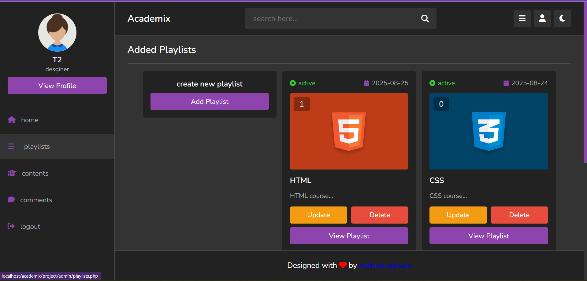
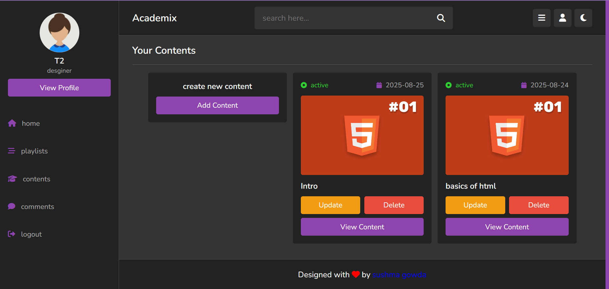
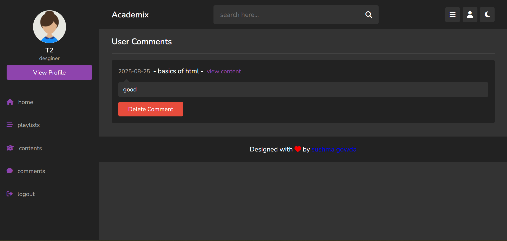

# 🎓 Academix - Online E-Learning Platform

Academix is a **web-based e-learning platform** where students and teachers can connect in a digital classroom environment.  
It allows students to learn from curated playlists, interact with teachers, and engage with course content through likes and comments.  
Teachers can upload playlists, add educational content, and manage student interactions seamlessly.

---

## ✨ Features

### 👩‍🎓 For Students
- 🔑 **Login/Register** securely  
- 📚 **Browse Courses & Playlists** created by teachers  
- ❤️ **Like & Comment** on course content  
- 📌 **Bookmark Playlists** to watch later  
- 👨‍🏫 **View Teacher Profiles** and explore their uploaded content  

### 👨‍🏫 For Teachers
- 🔑 **Login/Register** securely as a teacher  
- 📂 **Create Playlists** and add learning content (videos, docs, etc.)  
- 💬 **View Comments & Likes** from students  
- 📊 **Engage with Students** through interactive content  

---

## 🛠️ Tech Stack
- **Frontend:** HTML, CSS, JavaScript  
- **Backend:** PHP  
- **Database:** MySQL  
- **Server Environment:** XAMPP  

---
## 📷 Screenshots

### 👩‍🎓 Student View
- **Login / Dashboard**
  

- **Courses**
  

- **Teachers**
  

- **About**
  

- **Contact**
  

---

### 👨‍🏫 Teacher View
- **Dashboard**
  

- **Playlist**
  

- **Contents**
  

- **Comments**
  

